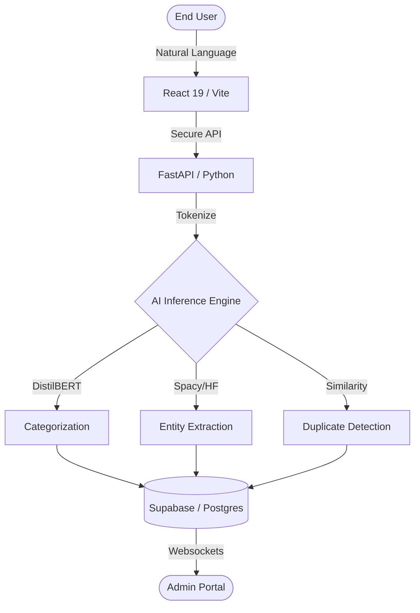

<div align="center">

# `H E L P D E S K . A I`
**The Intelligent Standard for Enterprise IT Service Management**

[](https://helpdeskaiv1.vercel.app/)
[](https://huggingface.co/spaces/ritesh19180/ai-helpdesk-api)
[](https://opensource.org/licenses/MIT)

---

### ⚡ Professional IT Support, Reimagined by AI.
*Helpdesk.ai eliminates manual triage by instantly categorizing, prioritizing, and routing tickets using deep-learning neural networks.*

[View the Demo](https://helpdeskaiv1.vercel.app/) • [Enterprise Hub](https://helpdeskaiv1.vercel.app/contact-sales) • [API Documentation](https://ritesh19180-ai-helpdesk-api.hf.space/docs)

</div>

<br/>

## 💎 The Enterprise Edge

Most IT desks suffer from "Manual Bottleneck"—the slow process of a human reading and routing every single ticket. **Helpdesk.ai** replaces that delay with millisecond-precision AI analysis.

### 🧠 Neural Core Features
- **Smart Triage Architecture**: Driven by a fine-tuned **DistilBERT** model that predicts category and priority level with context-aware sentiment analysis.
- **Entity Extraction (NER)**: Automatically pulls software names, server IDs, and locations directly from "messy" user descriptions.
- **Semantic Duel-Check**: Real-time duplicate detection prevents ticket floods during known system outages by grouping similar reported issues.
- **Enterprise Hub**: A dedicated lead-capture pipeline for organizations requiring dedicated infra, SLAM, and custom model weights.

---

## 🏗️ System Architecture

Our stack is built for high-concurrency production environments, leveraging a decoupled microservices architecture.



<br/>

## 🛠️ The Tech Ecosystem

We use only the most modern, industry-standard tools to ensure reliability and scalability.

| Layer | Tools |
| :--- | :--- |
| **Frontend** |     |
| **Backend** |    |
| **Infrastructure** |    |

---

## 💼 New Features

### 💳 Stripe Subscription Flow
We've integrated a seamless checkout experience for Growth teams. 
- **Redirect Engine**: A custom loading UI protects the transition from local state to secure Stripe Payment Links.
- **Tier Management**: Instant switching between Starter and Growth tiers.

### 🏢 Enterprise Lead Hub
A bespoke portal designed for B2B engagement. 
- **Secure Persistence**: Leads are captured directly into an RLS-protected Supabase table.
- **Custom Architect Consults**: Integrated form for high-volume organizations to request dedicated infra and compliance VAPT reports.

---

## 🚀 Deployment & Local Setup

### 1. Prerequisites
- Node.js v18.x+
- Python 3.10+
- Supabase Project

### 2. Environment Configuration
Create a `.env` in the `Frontend/` directory:
```bash
VITE_SUPABASE_URL=your_project_url
VITE_SUPABASE_ANON_KEY=your_key
VITE_STRIPE_GROWTH_LINK=https://buy.stripe.com/test_...
VITE_BACKEND_URL=http://localhost:8000
```

### 3. Installation
```bash
# Clone and install
git clone https://github.com/ritesh-1918/HELPDESK.AI.git
cd HELPDESK.AI/Frontend
npm install

# Start Development
npm run dev
```

---

<div align="center">

Built with ❤️ by the **HELPDESK.AI** Team  
*Empowering IT Teams with Artificial Intelligence.*

</div>
